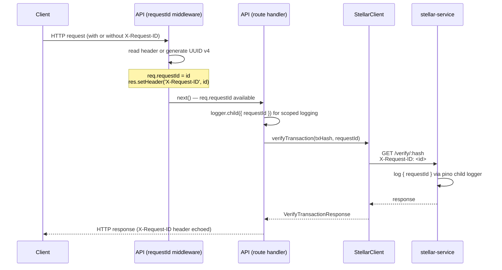

# Design Document: Request ID Propagation

## Overview

This feature adds end-to-end request ID propagation across the API and stellar-service. A unique `X-Request-ID` is assigned to every inbound API request (read from the header or generated as UUID v4), attached to the Express `Request` object, included in all structured log output, forwarded to the stellar-service on outbound calls, and echoed back to the caller in every response. The stellar-service reads the forwarded header and includes it in its own pino-based log output, enabling full distributed tracing for payment operations.

The implementation touches four areas:
1. A new Express middleware in the API (`requestId.middleware.ts`)
2. An extension to the Express `Request` type declaration
3. Updates to the `StellarClient` to forward the header
4. Adoption of pino in the stellar-service (replacing `console.log`/`console.error`)

## Architecture



## Components and Interfaces

### 1. `requestId.middleware.ts` (new file)

Location: `apps/api/src/middlewares/requestId.middleware.ts`

```typescript
import { Request, Response, NextFunction } from 'express';
import { randomUUID } from 'crypto';

export function requestIdMiddleware(req: Request, res: Response, next: NextFunction): void {
  const id = (req.headers['x-request-id'] as string) || randomUUID();
  req.requestId = id;
  res.setHeader('X-Request-ID', id);
  next();
}
```

Registered in `app.ts` before all route handlers, immediately after body parsing and sanitization middleware.

### 2. Express type extension

Location: `apps/api/src/types/express.d.ts` (existing file, extended)

```typescript
declare global {
  namespace Express {
    interface Request {
      user?: { userId: string; role: AppRole; clinicId: string };
      requestId?: string;  // added
    }
  }
}
```

### 3. `StellarClient` updates

The `verifyTransaction` and `healthCheck` methods gain an optional `requestId` parameter. When provided, the value is forwarded as the `X-Request-ID` header on the outbound Axios request.

```typescript
async verifyTransaction(txHash: string, requestId?: string): Promise<VerifyTransactionResponse> {
  const headers = requestId ? { 'X-Request-ID': requestId } : {};
  const response = await this.client.get(`/verify/${txHash}`, { headers });
  // ...
}

async healthCheck(requestId?: string): Promise<{ status: string; network: string; dryRun: boolean }> {
  const headers = requestId ? { 'X-Request-ID': requestId } : {};
  const response = await this.client.get('/health', { headers });
  // ...
}
```

Call sites in `payments.controller.ts` pass `req.requestId` to both methods.

### 4. stellar-service pino adoption

A pino logger instance is created in `apps/stellar-service/src/logger.ts` and imported by `index.ts`. All `console.log` and `console.error` calls are replaced. A per-request child logger is created from the incoming `X-Request-ID` header:

```typescript
// logger.ts
import pino from 'pino';
const isDev = process.env.NODE_ENV !== 'production';
export const logger = pino({
  level: process.env.LOG_LEVEL ?? 'info',
  ...(isDev ? { transport: { target: 'pino-pretty', options: { colorize: true } } } : {}),
});
```

```typescript
// index.ts — per-request child logger
app.use((req, _res, next) => {
  const requestId = req.headers['x-request-id'] as string | undefined;
  req.log = requestId ? logger.child({ requestId }) : logger;
  next();
});
```

## Data Models

No new persistent data models are introduced. The only data change is the addition of `requestId` to the in-memory Express `Request` object (a TypeScript interface extension).

### Log entry shape (API)

```json
{
  "level": 30,
  "time": 1700000000000,
  "requestId": "550e8400-e29b-41d4-a716-446655440000",
  "event": "payment_confirmed",
  "intentId": "...",
  "txHash": "..."
}
```

### Log entry shape (stellar-service)

```json
{
  "level": 30,
  "time": 1700000000000,
  "requestId": "550e8400-e29b-41d4-a716-446655440000",
  "msg": "verifying transaction"
}
```

When no `X-Request-ID` header is present, the `requestId` field is simply absent from the log entry.

## Correctness Properties

*A property is a characteristic or behavior that should hold true across all valid executions of a system — essentially, a formal statement about what the system should do. Properties serve as the bridge between human-readable specifications and machine-verifiable correctness guarantees.*

### Property 1: Request ID round-trip

*For any* inbound API request that carries an `X-Request-ID` header, the value of that header in the HTTP response must equal the value that was sent in the request.

**Validates: Requirements 1.1, 2.1**

### Property 2: Generated ID is a valid UUID v4

*For any* inbound API request that does NOT carry an `X-Request-ID` header, the `X-Request-ID` value returned in the response must be a well-formed UUID v4 string.

**Validates: Requirements 1.2, 2.1**

### Property 3: Response always carries X-Request-ID

*For any* HTTP request to the API (success or error path), the response must include an `X-Request-ID` header with a non-empty string value.

**Validates: Requirements 2.1, 2.2**

### Property 4: Log entries contain requestId

*For any* request processed by the API, every structured log entry emitted during that request's lifecycle must contain a `requestId` field equal to `req.requestId`.

**Validates: Requirements 3.1, 3.2**

### Property 5: StellarClient forwards requestId

*For any* call to `StellarClient.verifyTransaction` or `StellarClient.healthCheck` with a non-empty `requestId`, the outbound HTTP request to the stellar-service must include an `X-Request-ID` header equal to that `requestId`.

**Validates: Requirements 4.1, 4.2**

### Property 6: StellarClient omits header when no requestId

*For any* call to `StellarClient.verifyTransaction` or `StellarClient.healthCheck` where `requestId` is `undefined`, the outbound HTTP request must NOT include an `X-Request-ID` header.

**Validates: Requirements 4.3**

### Property 7: stellar-service logs received requestId

*For any* request to the stellar-service that includes an `X-Request-ID` header, all log entries emitted during that request must contain a `requestId` field equal to the received header value.

**Validates: Requirements 5.1, 6.2**

### Property 8: Payment operation uses same requestId end-to-end

*For any* payment confirmation request, the `requestId` logged by the API payments module and the `requestId` forwarded to (and logged by) the stellar-service must be identical.

**Validates: Requirements 6.1, 6.3**

## Error Handling

- If `randomUUID()` throws (extremely unlikely — it is a Node.js built-in), the error propagates to the global error handler. No special handling is needed.
- If the stellar-service is unreachable, the existing Axios error handling in `StellarClient` is unchanged; the `X-Request-ID` header is simply not received by the stellar-service in that case, which is acceptable.
- The `requestId` field on `Request` is typed as `string | undefined` in the interface extension. Middleware sets it before any route handler runs, so in practice it is always a string by the time route handlers execute. Call sites that pass `req.requestId` to `StellarClient` rely on this ordering guarantee.
- The error middleware (`error.middleware.ts`) runs after the `requestId` middleware, so `res.getHeader('X-Request-ID')` is already set when an error response is sent — no changes to the error handler are required.

## Testing Strategy

### Unit tests

- `requestIdMiddleware` with a request that has `X-Request-ID` header → `req.requestId` equals header value and response header is set.
- `requestIdMiddleware` with a request that has no `X-Request-ID` header → `req.requestId` is a valid UUID v4 and response header is set.
- `StellarClient.verifyTransaction` with a `requestId` → Axios request includes `X-Request-ID` header.
- `StellarClient.verifyTransaction` without a `requestId` → Axios request does NOT include `X-Request-ID` header.
- stellar-service request handler with `X-Request-ID` header → child logger is created with `requestId` field.
- stellar-service request handler without `X-Request-ID` header → base logger is used (no `requestId` field).

### Property-based tests

Property-based testing library: **fast-check** (already compatible with the TypeScript/Node.js stack; no new runtime dependency beyond dev).

Each property test runs a minimum of **100 iterations**.

Tag format: `Feature: request-id-propagation, Property <N>: <property_text>`

| Property | Test description |
|---|---|
| P1 | For any arbitrary string used as `X-Request-ID`, the middleware echoes it unchanged in the response header |
| P2 | For any request without the header, the generated value matches the UUID v4 regex |
| P3 | For any request (success or error), the response always has a non-empty `X-Request-ID` header |
| P4 | For any `requestId` string, a child logger created with it always includes that field in emitted entries |
| P5 | For any non-empty `requestId`, `StellarClient` always sets the outbound header to that value |
| P6 | For any call with `requestId = undefined`, `StellarClient` never sets the outbound header |
| P7 | For any `X-Request-ID` header value received by stellar-service, the per-request child logger always includes it |
| P8 | For any payment confirmation flow, the `requestId` in API logs equals the `X-Request-ID` forwarded to stellar-service |

Unit tests and property tests are complementary: unit tests cover concrete examples and integration points; property tests verify universal correctness across arbitrary inputs.
