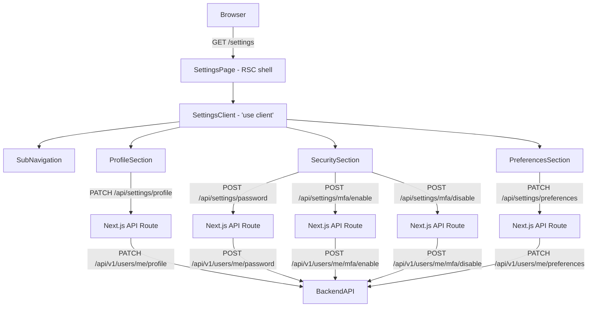

# Design Document: Settings & Profile

## Overview

The Settings & Profile feature adds a `/settings` route to the `apps/web` Next.js application. It is a client-rendered page within the existing dashboard layout that lets authenticated users manage their account across three sections: Profile, Security, and Preferences.

The page follows the same patterns already established in the codebase: React Hook Form + Zod for form validation, TanStack Query for server state, the existing UI component library (`Button`, `Input`, `Select`, `Modal`, `Avatar`), and Next.js API route proxies that forward requests to the backend API at `apps/api`.

The backend already has the `User` model with `fullName`, `mfaEnabled`, `mfaSecret`, and `password` fields. New API endpoints will be added to `apps/api` to support profile updates, password changes, MFA setup/teardown, and preference persistence.

---

## Architecture



The Next.js API routes act as thin proxies, forwarding the `accessToken` cookie as a `Bearer` token in the `Authorization` header — the same pattern used by the existing auth routes.

---

## Components and Interfaces

### Page and Layout

**`apps/web/src/app/settings/page.tsx`** — RSC shell that renders `SettingsClient`.

**`apps/web/src/app/settings/SettingsClient.tsx`** — `'use client'` component. Owns the active-section state (`'profile' | 'security' | 'preferences'`), fetches the current user profile on mount via TanStack Query, and renders `SubNavigation` alongside the active section panel.

```ts
type Section = "profile" | "security" | "preferences";
```

### SubNavigation

**`apps/web/src/components/settings/SubNavigation.tsx`**

```ts
interface SubNavigationProps {
  active: Section;
  onChange: (section: Section) => void;
}
```

Renders three `<button>` items. The active item receives `aria-current="page"` and a distinct visual style (left border accent + bold text).

### ProfileSection

**`apps/web/src/components/settings/ProfileSection.tsx`**

```ts
interface ProfileSectionProps {
  user: UserProfile;
}

interface UserProfile {
  fullName: string;
  email: string;
  role: string;
  clinic: string;
}
```

Uses `react-hook-form` + Zod. The Save button is only enabled when `fullName` differs from the initial value (controlled via `formState.isDirty`). On success, calls `queryClient.invalidateQueries(['me'])` to refresh the cached profile.

### SecuritySection

**`apps/web/src/components/settings/SecuritySection.tsx`**

```ts
interface SecuritySectionProps {
  mfaEnabled: boolean;
  onMfaStatusChange: () => void;
}
```

Contains two sub-components:

- **`ChangePasswordForm`** — three fields (Current Password, New Password, Confirm New Password) with a `PasswordStrengthBar`. Validates that New Password === Confirm New Password client-side before submitting.
- **`MfaToggle`** — displays current MFA status. Clicking "Enable" opens `MfaSetupModal`. Clicking "Disable" shows a browser `confirm()` dialog (or a small inline confirmation UI) before calling the disable endpoint.

### PasswordStrengthBar

**`apps/web/src/components/settings/PasswordStrengthBar.tsx`**

```ts
interface PasswordStrengthBarProps {
  password: string;
}

type StrengthLevel = "weak" | "fair" | "strong" | "very-strong";
```

Pure presentational component. Derives `StrengthLevel` from the password string using a scoring function (length, character variety). Renders four colored segments.

Scoring rules:

- Length < 8 → weak
- Length ≥ 8, only one character class → fair
- Length ≥ 8, two or three character classes → strong
- Length ≥ 12, all four character classes (lower, upper, digit, symbol) → very-strong

### MfaSetupModal

**`apps/web/src/components/settings/MfaSetupModal.tsx`**

```ts
interface MfaSetupModalProps {
  open: boolean;
  onClose: () => void;
  onSuccess: () => void;
  qrCodeUrl: string; // data URI returned by the enable-init endpoint
  secret: string; // base32 secret for manual entry
}
```

Wraps the existing `Modal` component. Displays the QR code image and a 6-digit `<Input>` (pattern `[0-9]{6}`). On submit calls the verify endpoint.

### PreferencesSection

**`apps/web/src/components/settings/PreferencesSection.tsx`**

```ts
interface PreferencesSectionProps {
  preferences: UserPreferences;
}

interface UserPreferences {
  language: string; // 'en' | 'fr'
  emailNotifications: boolean;
  inAppNotifications: boolean;
}
```

Language change reuses the existing locale cookie mechanism (`document.cookie` + `router.refresh()`). Notification toggles are rendered as `<input type="checkbox" role="switch">` elements. Each toggle fires a PATCH request on change; on failure the toggle reverts to its previous value.

### Next.js API Route Proxies

All routes live under `apps/web/src/app/api/settings/`:

| File                   | Method | Forwards to                          |
| ---------------------- | ------ | ------------------------------------ |
| `profile/route.ts`     | PATCH  | `PATCH /api/v1/users/me/profile`     |
| `password/route.ts`    | POST   | `POST /api/v1/users/me/password`     |
| `mfa/enable/route.ts`  | POST   | `POST /api/v1/users/me/mfa/enable`   |
| `mfa/disable/route.ts` | POST   | `POST /api/v1/users/me/mfa/disable`  |
| `preferences/route.ts` | PATCH  | `PATCH /api/v1/users/me/preferences` |

Each proxy reads the `accessToken` cookie and sets `Authorization: Bearer <token>`.

### Backend API Endpoints (apps/api)

New routes added to a `users` module:

| Method | Path                           | Body                                                      | Response                                 |
| ------ | ------------------------------ | --------------------------------------------------------- | ---------------------------------------- |
| GET    | `/api/v1/users/me`             | —                                                         | `UserProfile + mfaEnabled + preferences` |
| PATCH  | `/api/v1/users/me/profile`     | `{ fullName }`                                            | updated user                             |
| POST   | `/api/v1/users/me/password`    | `{ currentPassword, newPassword }`                        | 200 OK                                   |
| POST   | `/api/v1/users/me/mfa/enable`  | —                                                         | `{ qrCodeUrl, secret }`                  |
| POST   | `/api/v1/users/me/mfa/verify`  | `{ code }`                                                | 200 OK (activates MFA)                   |
| POST   | `/api/v1/users/me/mfa/disable` | `{ code? }`                                               | 200 OK                                   |
| PATCH  | `/api/v1/users/me/preferences` | `{ language?, emailNotifications?, inAppNotifications? }` | updated preferences                      |

---

## Data Models

### Frontend — Zod Schemas

```ts
// Profile form
const profileSchema = z.object({
  fullName: z.string().min(1, "Full name is required").max(100),
});

// Change password form
const changePasswordSchema = z
  .object({
    currentPassword: z.string().min(1, "Current password is required"),
    newPassword: z.string().min(8, "Password must be at least 8 characters"),
    confirmPassword: z.string(),
  })
  .refine((d) => d.newPassword === d.confirmPassword, {
    message: "Passwords do not match",
    path: ["confirmPassword"],
  });

// MFA verify form
const mfaVerifySchema = z.object({
  code: z.string().regex(/^\d{6}$/, "Must be a 6-digit code"),
});

// Preferences form
const preferencesSchema = z.object({
  language: z.enum(["en", "fr"]),
  emailNotifications: z.boolean(),
  inAppNotifications: z.boolean(),
});
```

### Backend — User Model Extension

The existing `User` model already has `mfaEnabled` and `mfaSecret`. A `preferences` sub-document will be added:

```ts
// Added to userSchema
preferences: {
  language: { type: String, default: 'en' },
  emailNotifications: { type: Boolean, default: true },
  inAppNotifications: { type: Boolean, default: true },
}
```

### TanStack Query Keys

```ts
["me"][("me", "mfa-status")]; // current user profile + preferences // mfaEnabled flag
```

---

## Correctness Properties

_A property is a characteristic or behavior that should hold true across all valid executions of a system — essentially, a formal statement about what the system should do. Properties serve as the bridge between human-readable specifications and machine-verifiable correctness guarantees._
